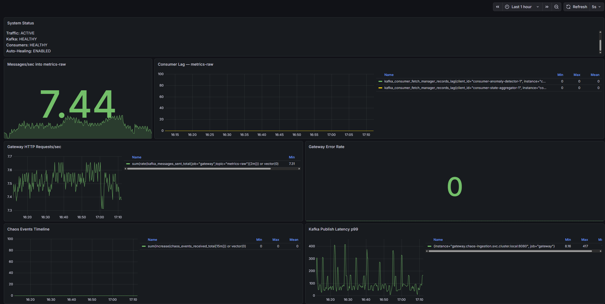
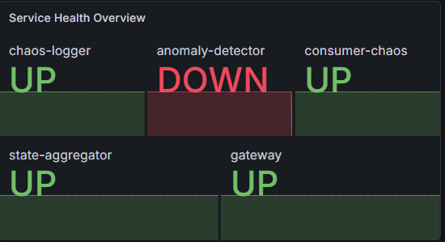
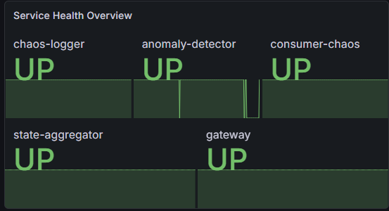

# Edge Observatory

Edge Observatory is a distributed systems project focused on one question: how does a telemetry pipeline behave under failure?

It simulates edge traffic, streams telemetry through Kafka, processes that data with Java consumers, injects controlled failures, and surfaces the results in Grafana. The goal is not just to collect metrics. It is to make resilience visible.

## What This Project Demonstrates

- High-throughput telemetry ingestion through a Go gateway
- Event streaming with Kafka in KRaft mode
- Multi-service processing with Java/Spring consumers
- Controlled chaos experiments against live workloads
- Automated remediation through a Janitor service
- End-to-end observability with Prometheus, Grafana, PostgreSQL, and Redis

This repo is intentionally scoped as a portfolio-safe version of the project. Core application code is included. Sensitive deployment details, live credentials, and environment-specific operational files are excluded.

## Architecture


## Why It Exists

Most student infrastructure projects stop at deployment. This one is about operation.

The interesting part of a distributed system begins when components fail:

- What happens to throughput when a consumer disappears?
- How quickly does the system recover?
- Can failures be observed clearly enough to explain them?
- Can remediation be automated instead of performed manually?

Edge Observatory was built to answer those questions with a concrete system rather than a diagram.

## Core Components

### Ingestion

The ingestion layer is written in Go and accepts telemetry events from probes and demo traffic generators. It publishes those events into Kafka and exposes operational metrics for Prometheus.

### Streaming Backbone

Kafka is the central event bus. The project uses KRaft mode rather than ZooKeeper-based Kafka, which keeps the architecture more modern and operationally simpler.

### Consumers

Java/Spring consumers process raw telemetry, aggregate state, and record chaos-related events. These services expose metrics via Micrometer and are scraped by Prometheus.

### Chaos Layer

The chaos controller introduces controlled disruptions so the system can be observed under stress. The Janitor service handles remediation paths and records recovery actions for visualization.

### Observability

Prometheus collects metrics. Grafana provides the dashboard layer. PostgreSQL stores incident and recovery records used by operational panels such as remediation history and recovery trend.

## Tech Stack

| Layer | Technology |
|---|---|
| Telemetry ingestion | Go |
| Transport / serialization | HTTP, gRPC, Protocol Buffers |
| Event streaming | Apache Kafka (KRaft) |
| Stream processing | Java 21, Spring Boot |
| Persistence | PostgreSQL, Redis |
| Remediation | Go, Kubernetes client-go |
| Observability | Prometheus, Grafana |
| Infrastructure | Kubernetes, Terraform, DigitalOcean |

## Repository Structure

```text
ingestion/         Go gateway and telemetry ingestion path
consumers/         Java/Spring consumers
janitor/           Auto-remediation service
chaos-controller/  Failure injection control plane
infra/             Sanitized infrastructure examples and local setup
probes/            Probe and load-generation helpers
scripts/           Utility scripts that are safe to keep in source
```

## What the Dashboard Shows

The Grafana dashboard is designed as an operations view, not just a metrics page. It focuses on:

- message throughput
- request rate
- Kafka publish latency
- service health
- consumer behavior under failure
- healing actions
- recovery time trend

In a demo run, the system is intended to show a clear lifecycle:

```text
traffic starts
-> system stable
-> failure injected
-> service degrades
-> remediation occurs
-> recovery is visible
```

## Screenshots

Add your screenshots here after export.

### Dashboard Overview



**Failure Moment**



**Recovery / Healing**



## Engineering Focus

This project is strongest as a systems and operations project. The important decisions were:

- using Kafka as the backbone instead of direct point-to-point service calls
- keeping observability first-class instead of bolting it on later
- treating chaos experiments as part of the normal workflow
- measuring recovery instead of only measuring uptime
- separating ingestion, processing, remediation, and visualization concerns

## Local Development

This repo includes local development helpers, but the public version is intentionally sanitized. Environment-specific credentials and live deployment secrets are excluded from source control.

At a high level, local development looks like:

```bash
git clone <your-repo>
cd EdgeObservatory

# start local dependencies and services using your local setup
# provide credentials via environment variables or ignored files
```

## Portfolio Notes

This is not meant to be a generic CRUD platform with dashboards added on top. It is a resilience-oriented systems project built around:

- telemetry pipelines
- failure injection
- observability
- automated recovery

That combination is the point of the project.

## Author

Jeshwanth Singh  
Software / backend / infrastructure-focused engineer  

GitHub, LinkedIn, blog, and demo links can be added here.
